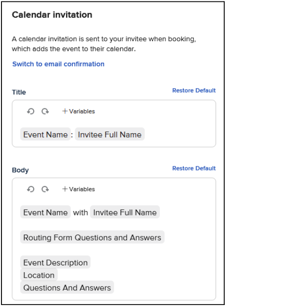
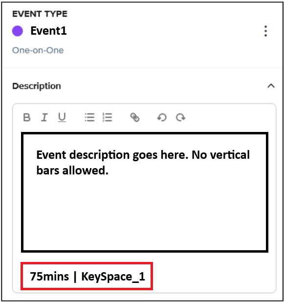
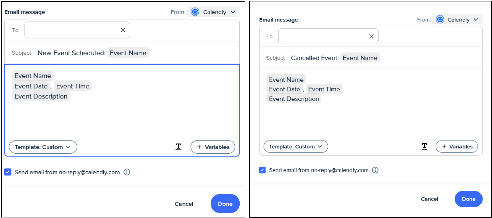
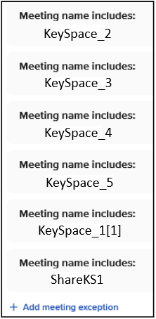
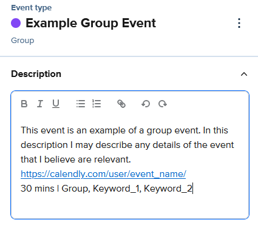

# multi_cal Overview
multi_cal is a utility built on behalf of the Harvard SEAS Active Learning Labs for aligning shared calendars between its workshops and sub-groups. Its purpose is to fill in the gaps of Calendly's capabilities on the client-side through the use of the Google Suite's API.

multi_cal enables users to schedule events via Calendly that reserve specific shared resources and which occupy spaces/use resources in a non-blocking manner.

The multi_cal codebase should be readable enough that it explains itself. In this ReadMe, we will go over the steps to setting up multi_cal with a Google account and creating the communication link to your Calendly account.

# Google Apps Script
For multi_cal to work, it needs to be hosted on a dedicated email account. Either select an existing account or create a new one (it will need to have access to the full Google Suite), then navigate to Google Apps Script. Once there, you need to create a new project (you can name it whatever you like) and paste the multi_cal.js code into the editor. Once that is done, you will need to change the three dictionaries (OCCUPANCY_RULES, KEYWORD_TREE, and CALENDAR_TREE) to reflect your setup/purposes.

# Structure Overview
1. All event descriptions in Calendly must include keywords that indicate what spaces and/or resources are **in use** during that event. These will follow a specific format.
    - Shop/space and resource/equipment keywords cannot be shared across items that are completely independent of one another (i.e. two identical tools that are in separate shops/spaces will require two distinct keywords).
2. Multiple calendars must always be checked, but **only your personal calendar should be scheduled on.**
    - The scheduler’s calendar is used to check if the individual is available
    - A shared calendar is used to check if the appropriate space or resource is available
3. Each event must be provided free/busy exception rules in Calendly to make use of the keywords.
    - Using exceptions, we can ensure events in separate spaces do not get falsely flagged as conflicting while also ensuring that events scheduled with two different individuals do not end up double-booking a single space/resource.
    - For instance, provided there is staff available, an event in KeySpace_1 can always be booked over an event in KeySpace_2. Similarly, if KeySpace_2 has Resource_2 and Resource_3, then Resource_2 time should be able to be booked over Resource_3 time so long as there is room available in KeySpace_2.
4. A Calendly workflow sends update emails automatically to the email hosting multi_cal. multi_cal then synchronizes the shared calendar using the information provided by those emails.
    - multi_cal adds the keywords from the event description in step 1 to the event **name** and adds that event to the shared calendar.
    - Calendly can then see those keywords in the event name and applies exception rules to the shared calendar. Keywords should NOT be present in your personal events or in titles of events you create through Calendly. Otherwise, exceptions may be applied to events on your personal calendar (which causes unwanted double-booking).

## Decide on Your Keywords
Decide keywords for your spaces/shops and equipment/resources. Remember, **you’ll need to create an exception for almost every keyword that does not apply to your event.** I recommend making a template event in Calendly that has all exceptions inside for ease of use. _**Keywords also need to be unique enough that they won’t come up in events you make on your calendar manually.**_ For example: "Space1" is a good keyword, but "Space" is not as it can come up regularly in day-to-day use of Google Calendar.

You can minimize the keywords you need to make exceptions for by using umbrella keywords for whole spaces/shops in addition to keywords for specific resources. For instance, if I am making an event in the KeySpace_1 space, I will only need to add exceptions for two sets of keywords: the other spaces/umbrella keywords (KeySpace_2, KeySpace_3, KeySpace_4, etc) and the keywords for KeySpace_1 sub-resources/equipment that this event does not conflict with. This method allows you to replace the exceptions you would have to make for every resource of a certain space with just the exception for the keyword of the space itself (the umbrella keyword). You will need to set up these umbrella relationships in the KEYWORD_TREE dictionary at the top of the code.

## Initial Setup
In Calendly, you’ll need to enable checking multiple calendars from your account page. **NOTE: This will apply to all event types you have ever created. Do not take this step if you are not prepared to edit all of your events.**

Go to Availability >> Calendar Settings >> Connect Calendar Account

From there you can connect as many additional calendars as you would like. However, you should still have your **personal calendar selected as the calendar for events to be scheduled on.**

## The Calendar Invite
In Calendly, you will need to make sure that the calendar invitations on your events are set up correctly. 

Ensure that the event has the appropriate **keywords in its description** (details on this later) and that **no keywords are present in the title of the calendar invitation.**

While editing the event, this is done in the Calendar Invitation subsection of the Notification and Workflows section.

In that subsection, you have the option to change what the event will be called on the calendar and what content will be in the event body--Calendly also gives you some useful variables that you can insert into these fields.

No variables or descriptors you decide to include in the invitation’s title can include keywords or else the system may erroneously double book you. Keywords are reserved for the Event Description section in Calendly. Later, when you set up your workflow, Calendly will send the Event Description to multi_cal via an email, and through that email, multi_cal will know what keywords to add to the event on the shared calendar.

## Workflows and Google Apps Script
You as a user should not need to use Google Apps Script beyond the initial setup and occasional maintenance of the system. Instead, you will largely employ a set of two workflows in Calendly which will manage the shared calendar(s) for you.

For the system to work appropriately you will need to have the following things done: 
1. All events you create have **keywords in their Event Description** and **no keywords in the Calendar Invite title.** Remember that the keywords in the description should describe what resources are being _used_.

    - The last paragraph of the description should be formatted **<< {Duration (in minutes)} | {List of Comma-Separated Keywords} >>** With no new-line breaks. See the example below. You can type any unit signifier for the minutes you like (‘min’, ‘mins’, ‘m’, ‘minutes’, or nothing at all)
      
    - The Free/Busy Exception Rules for the event should be for any keyword that does not conflict with this event. For an event using the KeySpace_1 space, the event should have an exception for every other space offered by your team(s) (i.e. KeySpace_2, KeySpace_3, and so on).
    - **Free/Busy Exception rules on round-robin events need to be made for each host.** The creator of the event is not able to make global exceptions.

3. The two workflows you set up must include the relevant event info in a message to the host email:

    - The subject line must start with the action being done. If scheduling a new event, it should start with “new.” If cancelling, it should start with “cancel.” Case does not matter.

    - The workflow must send an email to the email that is hosting multi_cal

    - The workflow must have “send from no-reply@calendly.com” checked

    - The body of the message must follow this format EXACTLY:
    

_**The comma and space between Event Date and Event Time are both required for the date to be processed correctly.**_

# The Occupancy Feature (Optional)
multi_cal has occupancy limits hard-coded into a dictionary at the very beginning of the script. It is a constant named OCCUPANCY_RULES.

The exact values can be adjusted and expanded upon, and they are referenced as events are scheduled to make sure no room ever exceeds the set max occupancy.

To make use of the occupancy feature, simply include bracketed ends directly after a keyword in the Event Description to signify how much of that space or resource the event will take up. Please note that if you do this for a specific resource, you should also include an occupancy tag of the same magnitude for any umbrella keyword that resource falls under.

Example: KeySpace_1[2] where the 2 represents the attendance/space this event is taking up. There are 3 spots available in the KeySpace_1 space according to the coded dictionary.
An event with this tag should be able to double-book any time where 2 or more spaces remain available in KeySpace_1.

## Calendar Invite Title:
You will need to **include the _sharing_ keyword for the space/resource in the calendar invite title!** Yes, this is an exception to the "Do not include keywords in the Calendar Invite title" rule.

The convention I use is that share keywords for spaces/umbrellas are the word “Share” + the initials of the space. See below:
  - KeySpace_1 [ShareKS1] - KeySpace_1 Event
  - KeySpace_2 [ShareKS2] - KeySpace_2 Event

For resource sharing, the format is similar, but the convention I use is “ShareR” + initials:
  - Resource_1 [ShareRR1] - Uses Resource_1 in KeySpace_1
  - Resource_2 [ShareRR2] - Uses Resource_2 in KeySpace_2
  - Resource_3 [ShareRR3] - Uses Resource_3 in KeySpace_2

The code does not look for this convention, so you can adopt any style that you see fit. HOWEVER, as with keywords in general, **you must be prudent that no share keyword _contains_ another keyword within itself.** Otherwise exceptions may be applied when they should not be. 

Generally, the share keyword exists to allow yourself to be double-booked as an individual under the right circumstances in addition to allowing spaces/resources to be double-booked (if you do not want this behavior, simply do not include the share keyword in the calendar invite title). Were it not for the share keyword, a space might allow multiple events to be booked within it but Calendly would look for a different supervisor for each event wanting to use the space.

## Order of Operations: 

**Initial Case:**

A base event gets scheduled. It overlaps no other events. Its title is “Event1 Tag: ShareKS1” and its description keyword is “KeySpace_1[1]”

The script will subtract the event attendance (1, in this example) from the occupancy limit in the OCCUPANCY_RULES dictionary. From there, it will create a string to show many spots are left _available_ in the room by creating the list of attendance sizes that can still be supported: “KeySpace_1[2], KeySpace_1[1]”. This string is then used as the title for a separate event in the calendar to facilitate aligning attendance/occupancy between multiple events. The normal calendar entry for the event will include its original tag (“Event1 Tag: KeySpace_1”) but its free/busy state will be set to “Free” to prevent it from falsely blocking other events.

**Overlaps:**

An overlapping event, “Event 2” with description keyword “KeySpace_1[2]” will be scheduled as “Event2 - KeySpace_1” with its free/busy rule set to “Free”. Any MechEMain occupancy-tracking events that overlap with this new event will be updated with remaining spaces reduced by 2. The script will even split the existing occupancy-tracking events if the overlap is only partial to ensure only the affected time has a reduced availability.

**Exception Rules:**

To allow a space to be double booked: the event booking rules for an occupancy-based keyword require an exception for events with the _same_ keyword occupancy tag.

To allow a single supervisor for multiple events in the same keyword-space, an exception for the relevant sharing keyword is also necessary.

i.e. to get both of the above effects, the event would have the description keyword TAG[X] and would have an exception rule for the same TAG[X] as well as for ShareTAG.

This does not interfere with the normal system, as because TAG[X] includes TAG, anything with a TAG exception will still correctly ignore the TAG[X] events and anything not compatible with ShareTAG will still be blocked.

# The Enrollment Feature (Optional)
## Overview:
The Occupancy Feature and most other features of this setup do not account for group events. The idea is that group events can be scheduled inherently by checking if there is space and staff available through the occupancy feature. But what if you want to eliminate any meetings with a single student? To ensure a minimum number of students are enrolled in a training (and to display the available slots to the students), users must employ this Enrollment Feature.

The Enrollment Feature works very similarly to the Occupancy Feature however, instead of working with one-on-one events and keywords, the Enrollment Feature works with group events in Calendly and requires no additional sharing keywords like the Occupancy Feature does (unless you are trying to use the Occupancy Feature in tandem with this one). The Enrollment Feature adds a link with the appropriate event and timestamp information embedded to the shared events so that students can add themselves onto the events simply by checking the calendar and following that link. The link is removed once maximum occupancy is reached.

The title of these events reflect whether the event is full, available, or still tentative. If not enough people have signed up yet, it remains “Tentative.” Then it moves to “Confirmed.” Then, once all spots are filled, it moves to “Full.”

If the event is still Tentative when the confirmation window ends, the event is cancelled automatically. This information is kept in the ENROLLMENT_RULES dictionary as a triple. The Key will be the event name and the information associated will be the modification deadline, the minimum enrollment, and the maximum enrollment. That modification deadline is the amount of time in minutes before the scheduled event by which the event must reach minimum capacity. If you want your event to be cancelled an hour ahead of time if there aren’t enough people, that number would be 60. If you want your event to be cancelled a day ahead of time, that number would be 1440.

Example: 
“Resource_1 Training” : [1440, 3, 6]

This value means that our Resource_1 Training must reach an enrollment of 3 people 1440 mins (24hrs) in advance of the event start and that no more than 6 people may sign up.

## Setup:
Event Description:
Event descriptions will need to include a link to the booking page on a separate line immediately before the event duration and keywords. This link will be modified by the script to send individuals directly to the instance-specific booking when an event is clicked on from the calendar.

**Basic Keywords:**
The event must have “Group” as its first keyword if it is a group event. Any number (or zero) keywords may follow it.

For the exception rules, if you are using keywords, there are no changes to how that works. Just apply them as you would normally.

**Occupancy Keywords:**
Any occupancy-based keywords should reflect the maximum enrollment of the group event. 

*If there are resources being used for the group event that have fewer spaces than there are enrollees, the maximum for that resource should be entered for that keyword.* For example, if Resource_1 only has 2 spaces but this group event has a maximum enrollment of 5, the correct Occupancy Keyword to use is Resource_1[2].

*If the resource can fit more than the max enrollment, then the max enrollment number should be used instead.* For example, if the event’s max enrollment is 5 and it is using Resource_2 (which can fit 6 spaces), it should be tagged Resource_2[5].

*For Share Keywords, you will need to include them in the title of the event.* This is a bit clunky, but there is no way to edit the calendar invite for a Group Event, so if you want to use a Share Keyword to make use of the Occupancy Feature, it will have to go in the event’s title on Calendly. Be sure that this is also reflected in the dictionaries as appropriate.

## Apps-Script Setup:
On the hosting account, update the ENROLLMENT_RULES dictionary and the CALENDAR_TREE Dictionary.

As mentioned in the overview, the ENROLLMENT_RULES dictionary tells the script when to stop accepting updates to the event, what the minimum enrollment is, and what the maximum enrollment is. This allows the script to keep track of how to title events according to the current enrollment numbers.

The event title will need to be put into the CALENDAR_TREE dictionary as well as though it were a keyword. The event title should work be the key and that key should be associated with whichever user-facing calendar group is most relevant.

## Calendar Interface:
The calendar that Group Events are placed on should be separate from the keyword/occupancy calendars so that the calendar may be shared with students directly. This public-facing calendar allows students to join existing slots in order to more efficiently meet minimums.

Users can use a link on the event to sign up for that same time-slot until the event is full. If the sign-up window has elapsed, then the event will either be cancelled (if it did not meet the minimum enrollment) or it will remain confirmed but the join link will be removed.

When an event is cancelled, a placeholder event is kept on the calendar to show users that the event at that timew as cancelled. The "Cancelled" event will no longer have a signup description, but it will still include the event name in the title. The event will also be set to “Free” to prevent it from showing up as busy elsewhere. 

**Note:** This script *does not send email updates.* In order to do so, it would need to collect personal information from Calendly, and that would require more security features to be implemented than I can provide. Users should be instructed to keep track of the public calendar and to use the calendar to verify whether their events are confirmed or not.

# Maintaining the Code
To ensure functionality, there are a couple areas of the code that will need updating whenever the usage expands. They are the three constant dictionaries at the start of the code. First is the OCCUPANCY_RULES dictionary.

This dictionary contains a matched set of keywords with a specific quantifiable occupancy and the integer representing that occupancy limit. If more resources are added requiring occupancy rules or if the occupancy limit of any resources are changed in some other way, this dictionary will need to be edited to reflect that.

Next are the two tree dictionaries.

If any resources are shuffled around or if new calendars are deployed to represent different categories of spaces, these dictionaries will need to be updated. If usage is expanded to include other areas/categories, you will want to create unique keywords for those areas/categories and a separate calendar for them, as well, if necessary.

**Do note that adding a calendar ID to the dictionary does not automatically make this code function.**

_**You will need to share the calendar with the host email address so that it has the permissions required to create events on the calendar.**_
